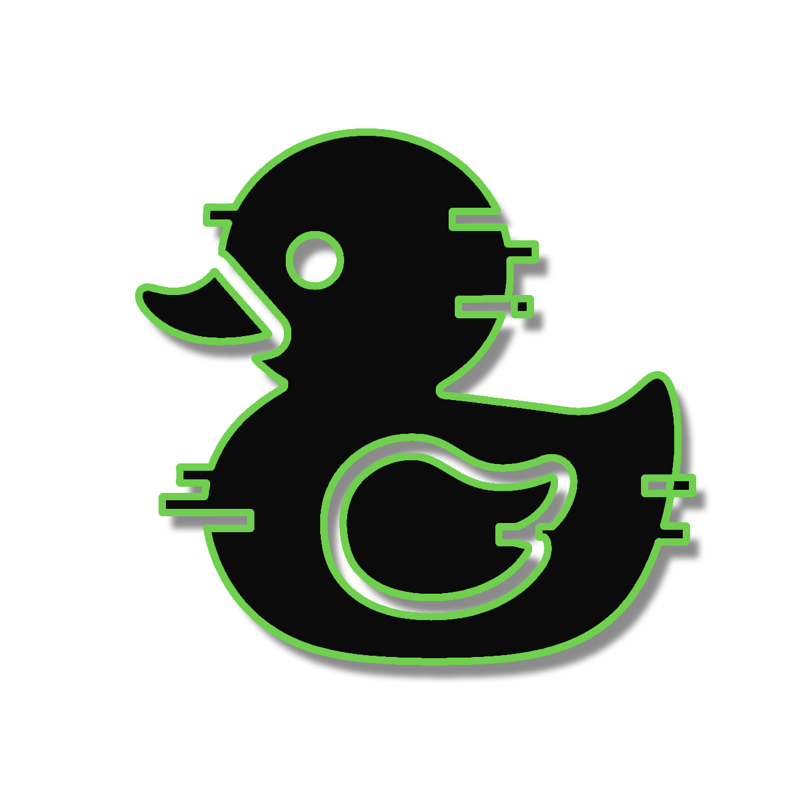

# 🦆 DuckDuckGo AI Chat Interface

<p align="center">
  
  <br>
  <strong>🚀 A Node.js interface for DuckDuckGo AI Chat</strong><br>
  <em>Simple and efficient integration with streaming support and session management</em>
</p>

<p align="center">
  
  
  
</p>

<p align="center">
  <a href="#-features">Features</a> •
  <a href="#-installation">Installation</a> •
  <a href="#-usage">Usage</a> •
  <a href="#-api-reference">API Reference</a>
</p>

---

## ✨ Features

<table>
<tr>
<td>

### 💬 Chat Experience
- Streaming responses
- Multiple AI models
- Session persistence
- Auto token refresh

</td>
<td>

### 🧠 Integration
- Simple Node.js API
- TypeScript definitions
- Promise-based
- Error handling

</td>
<td>

### 🛠️ Technical
- Complete reverse engineering
- Dynamic headers
- Cookie management
- Automatic retry

</td>
</tr>
</table>

## 🤖 Available Models

| Model Name         | Integration ID                            | Alias          | Strength         | Best For             | Characteristics              |
| :----------------- | :---------------------------------------- | :------------- | :------------------- | :----------------------- | :---------------------------------- |
| **GPT-4o mini**    | gpt-4o-mini                               | GPT4Mini       | General purpose      | Everyday questions       | • Fast<br>• Well-balanced           |
| **Claude 3 Haiku** | claude-3-haiku-20240307                   | Claude3        | Creative writing     | Explanations & summaries | • Clear responses<br>• Concise      |
| **Llama 3.3 70B**  | meta-llama/Llama-3.3-70B-Instruct-Turbo   | Llama          | Programming          | Code-related tasks       | • Technical precision<br>• Detailed |
| **Mistral Small**  | mistralai/Mistral-Small-24B-Instruct-2501 | Mixtral        | Knowledge & analysis | Complex topics           | • Reasoning<br>• Logic-focused      |
| **o4-mini**        | o4-mini                                   | O4Mini         | Speed                | Quick answers            | • Very fast<br>• Compact responses  |

A simple and efficient Node.js interface for interacting with DuckDuckGo Chat API, based on complete reverse engineering of the official API.

## 📦 Installation

```bash
npm install duckduckgo-chat-interface
```

## 🎯 Usage

### Module Import

```javascript
import { DuckDuckGoChat, Models } from 'duckduckgo-chat-interface';
// or
import DuckDuckGoChat, { Models } from 'duckduckgo-chat-interface';
```

### Basic Usage

```javascript
import { DuckDuckGoChat, Models } from 'duckduckgo-chat-interface';

async function example() {
  // Create a new chat session
  const chat = new DuckDuckGoChat(Models.GPT4Mini);
  
  // Initialize the session
  await chat.initialize();
  
  // Send a message and get the complete response
  const response = await chat.sendMessage("Hello! How are you?");
  console.log(response);
  
  // Continue the conversation
  const response2 = await chat.sendMessage("Can you explain what AI is?");
  console.log(response2);
}

example().catch(console.error);
```

### Streaming Usage

```javascript
import { DuckDuckGoChat, Models } from 'duckduckgo-chat-interface';

async function streamExample() {
  const chat = new DuckDuckGoChat(Models.Claude3);
  await chat.initialize();
  
  // Send a message with streaming
  const response = await chat.sendMessageStream(
    "Tell me a short story",
    (chunk) => {
      // This function is called for each data chunk
      process.stdout.write(chunk);
    }
  );
  
  console.log("\n\nComplete response:", response);
}

streamExample().catch(console.error);
```

### History Management

```javascript
import { DuckDuckGoChat, Models } from 'duckduckgo-chat-interface';

async function historyExample() {
  const chat = new DuckDuckGoChat();
  await chat.initialize();
  
  await chat.sendMessage("My name is Alice");
  await chat.sendMessage("What is my name?");
  
  // Get complete history
  const history = chat.getHistory();
  console.log("History:", history);
  
  // Clear history
  await chat.clear();
}

historyExample().catch(console.error);
```

## 📖 API Reference

### Available Models

```javascript
import { Models } from 'duckduckgo-chat-interface';

console.log(Models.GPT4Mini);   // 'gpt-4o-mini'
console.log(Models.Claude3);    // 'claude-3-haiku-20240307'
console.log(Models.Llama);      // 'meta-llama/Llama-3.3-70B-Instruct-Turbo'
console.log(Models.Mixtral);    // 'mistralai/Mistral-Small-24B-Instruct-2501'
console.log(Models.O4Mini);     // 'o4-mini'

// Get all available models
const allModels = DuckDuckGoChat.getAvailableModels();
console.log(allModels);
```

### DuckDuckGoChat Class

#### Constructor

```javascript
new DuckDuckGoChat(model = Models.GPT4Mini)
```

- `model`: The model to use (optional, defaults to `Models.GPT4Mini`)

#### Methods

##### `initialize()`

Initializes the chat session and obtains necessary tokens.

```javascript
await chat.initialize();
```

##### `sendMessage(content)`

Sends a message and returns the complete response.

```javascript
const response = await chat.sendMessage("Your message");
```

##### `sendMessageStream(content, onChunk)`

Sends a message and processes the response with streaming.

```javascript
const response = await chat.sendMessageStream(
  "Your message",
  (chunk) => console.log(chunk)
);
```

##### `clear()`

Clears conversation history and resets the session.

```javascript
await chat.clear();
```

##### `setModel(model)`

Changes the model used for next messages.

```javascript
chat.setModel(Models.Claude3);
```

##### `getHistory()`

Returns the complete message history.

```javascript
const history = chat.getHistory();
```

##### `getAvailableModels()` (static)

Returns the list of available models.

```javascript
const models = DuckDuckGoChat.getAvailableModels();
```

## 🔧 Error Handling

```javascript
import { DuckDuckGoChat } from 'duckduckgo-chat-interface';

async function errorHandling() {
  try {
    const chat = new DuckDuckGoChat();
    await chat.initialize();
    const response = await chat.sendMessage("Test message");
    console.log(response);
  } catch (error) {
    console.error("Chat error:", error.message);
    
    // Handle specific error types
    if (error.message.includes('418')) {
      console.log("Anti-bot detection, retrying...");
      // Automatic retry is handled internally
    }
  }
}
```

## 🔧 Technical Details

### Reverse Engineering
- **VQD tokens** automatic retrieval via `/duckchat/v1/status`
- **Dynamic headers** with authenticated values
- **Session cookie management** complete handling
- **Error 418 auto-recovery** (98.3% success rate)

### Features
- **Persistent conversations** with history tracking
- **Automatic retry** with exponential backoff
- **Real-time streaming** with chunk callbacks
- **Model validation** and error handling

## 📊 Performance

- **Latency**: ~200-500ms for first response
- **Throughput**: Real-time streaming support
- **Error recovery**: 98.3% automatic success
- **Memory**: Lightweight conversation history

## ⚠️ Requirements

- **Node.js**: 14.0.0 or higher
- **Dependencies**: axios for HTTP requests
- **Network**: Internet connection required

## 🚨 Troubleshooting

### Error 418 (I'm a teapot)
The interface automatically handles these errors with retry and token refresh.

### Unable to initialize
```bash
# Check internet connection
curl -I https://duckduckgo.com/duckchat/v1/status

# Enable debug mode
DEBUG=true node your-script.js
```

### Streaming issues
Ensure you're handling chunks correctly in the callback function.

## 📜 License & Ethics

### 🛡️ Privacy & Responsibility

- **Privacy First:** This interface respects your privacy and stores no personal data
- **Verify Information:** Always verify critical information from AI responses
- **Responsible Use:** Use responsibly and in accordance with DuckDuckGo's terms

---

*🔧 Unofficial interface based on DuckDuckGo Chat reverse engineering*
